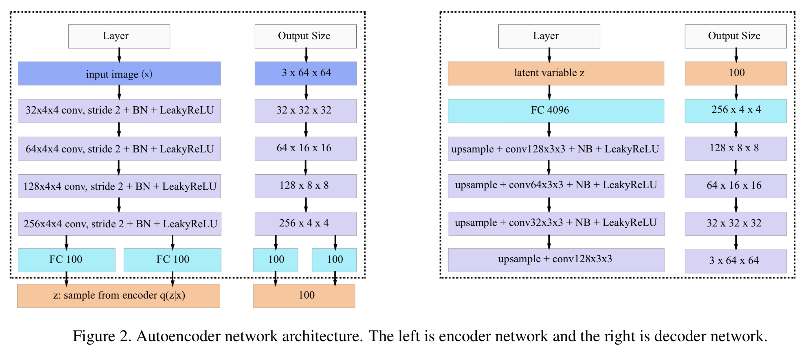
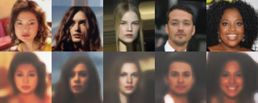
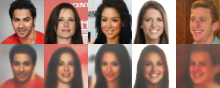
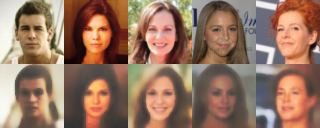
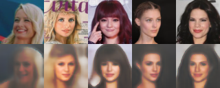
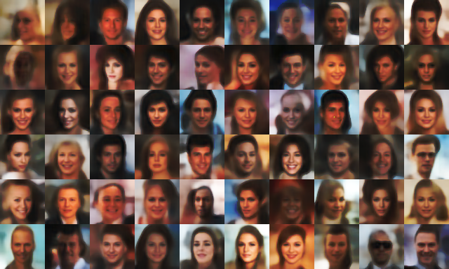

# Face Generation Using Variational Autoencoders
This repo containing training code for two different VAEs implemented with Pytorch.  
I used the [CelebA](http://mmlab.ie.cuhk.edu.hk/projects/CelebA.html) Dataset for training, with 182637 training images and 19962 testing images.  
Trained model can be found in [/samples](/samples).

## Model structures:

#### [β-VAE [1]](https://openreview.net/pdf?id=Sy2fzU9gl):

#### [DFC-VAE [2]](https://arxiv.org/abs/1610.00291):

## Results:

##### Original Faces (Top) vs. Reconstructed (Bottom) :
 
 

##### Linear Interpolation from z1 (leftmost) to z2 (rightmost):

##### Vector Arithmetic from original (leftmost) to wearing sunglasses (rightmost):

##### Generated Images with random sampled latent z ~ N(0, 1):

(Notes: output images above are results after image dehazing using [this script [3]](https://github.com/cssartori/image-dehazing.git))

## References
[1] β-VAE: https://openreview.net/pdf?id=Sy2fzU9gl  
[2] DFC-VAE: https://arxiv.org/abs/1610.00291  
[3] Dehaze: https://github.com/cssartori/image-dehazing.git
